# Сервис для подачи показаний счетчиков отопления, горячей и холодной воды

## Welcome!

WEB приложение. С сохранением данных в БД

## Используемые технологии:

* Java 17

* Maven

* TomCat

* Liquibase

### 1. Запуск приложения.
Запустите TomCat. Скачайте war файл https://github.com/Arcady555/MonitoringService/blob/homework_%233/target/MonitoringService-1.0-SNAPSHOT.war
Вставьте его в Тomcat  в папку /apache-tomcat-8.5.98/webapps . Переименуйте war файл в Mo.war

1й вариант работы с приложением - через страницы в браузере
Зайдите в браузере на страницу http://localhost:7070/Mo/start (номер порта localhost зависит от натсроек Вашего TomCat!)
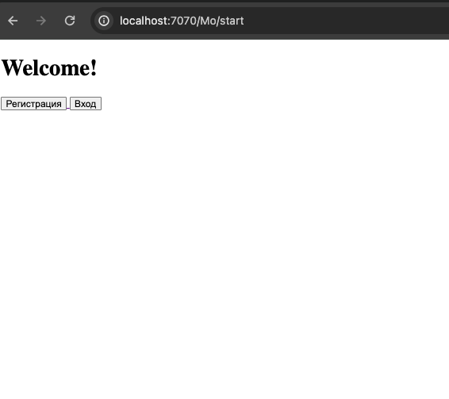
И далее кликайте по ссылкам

2й вариант - через отправку HTTP- запросов, например через PostMan
* Зарегистрируйтесь (http://localhost:7070/Mo/rest_reg):
  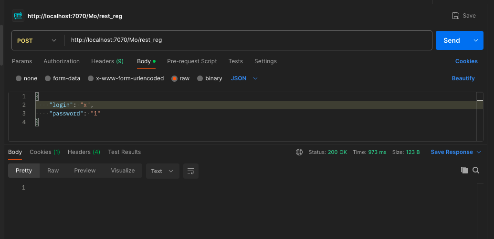
* Далее запросы отправлять с авторизацией:
  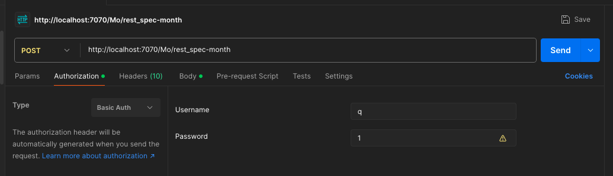
* Отправить данные(http://localhost:7070/Mo/rest_submit-data):
  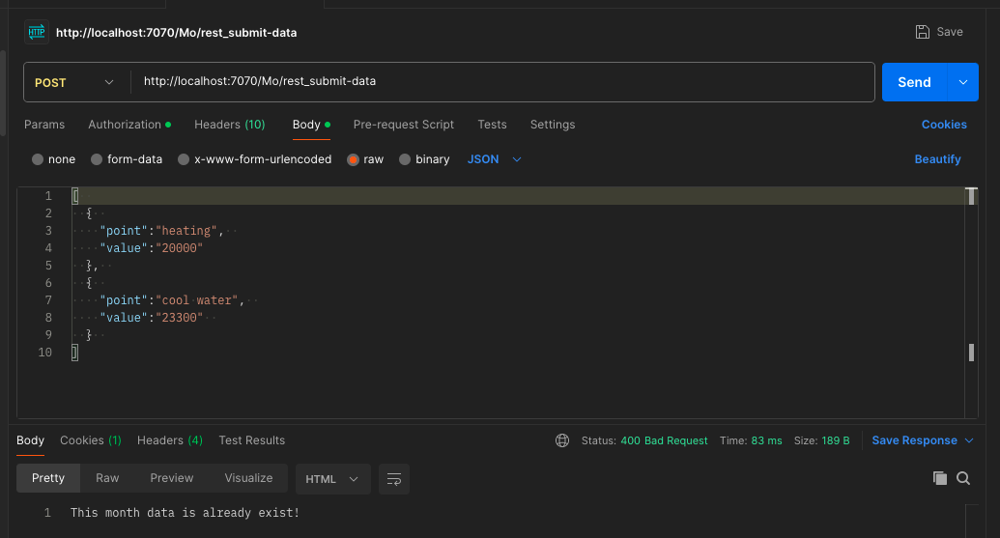
* Посмотреть свои данные за конкретный месяц(http://localhost:7070/Mo/rest_spec-month):
  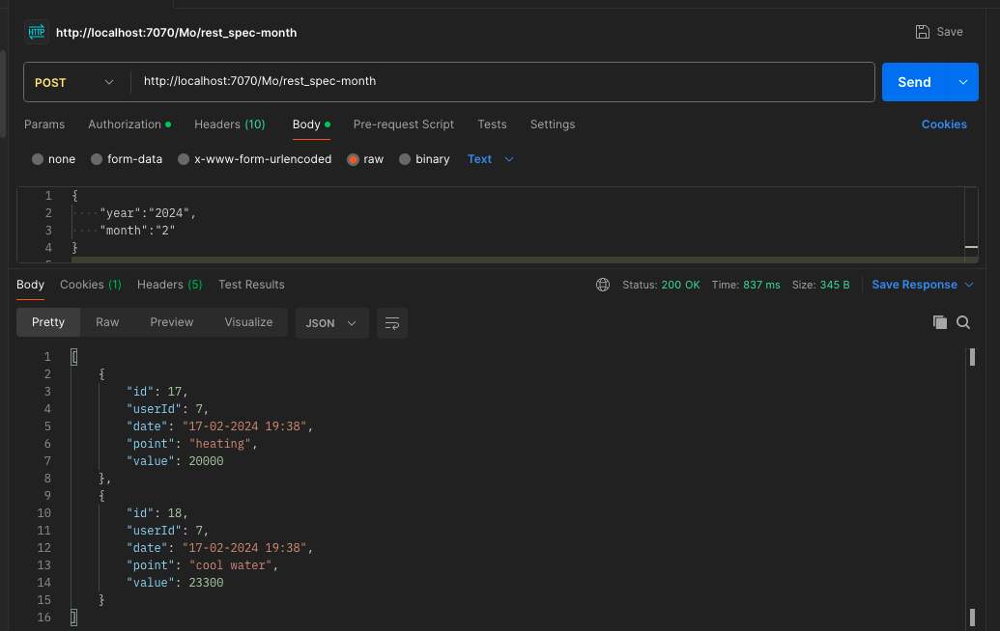
* Посмотреть свои последние данные (http://localhost:7070/Mo/rest_last-data):
  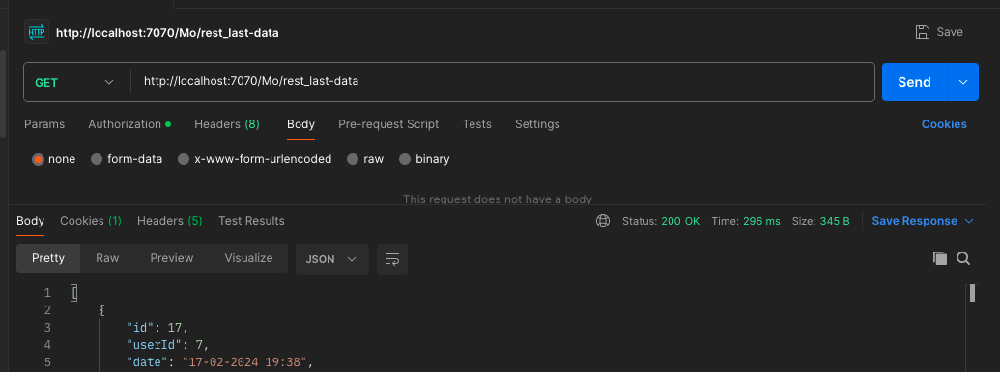
* Посмотреть все свои данные (http://localhost:7070/Mo/rest_data-history):
  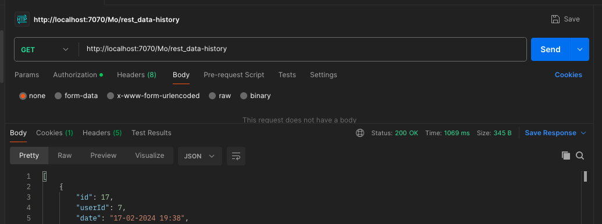

Следующие запросы доступны только админу
* Посмотреть список всех пользователей(http://localhost:7070/Mo/rest_all-users):
  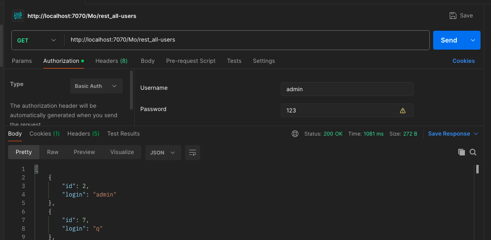
* Посмотреть все данные выбранного пользователя (http://localhost:7070/Mo/rest_history-data-user):
  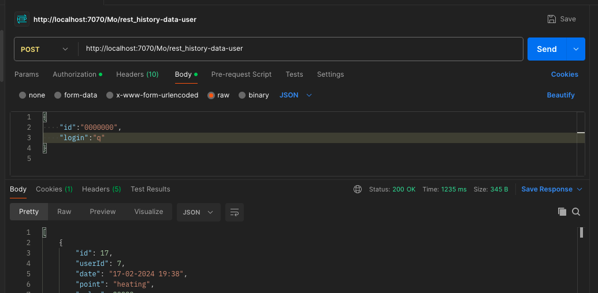
* Посмотреть последние данные выбранного пользователя (http://localhost:7070/rest_last-data-of-user):
  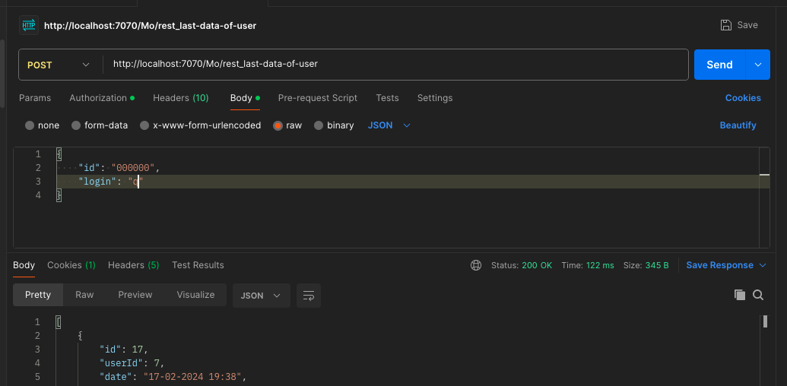
* Посмотреть данные выбранного пользователя за конкретный месяц (http://localhost:7070/Mo/rest_spec-month-user):
  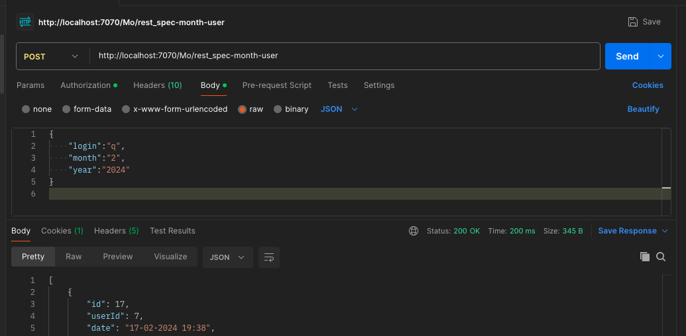
* Посмотреть мониторинг выбранного пользователя (http://localhost:7070/Mo/rest_view-user-history"):
  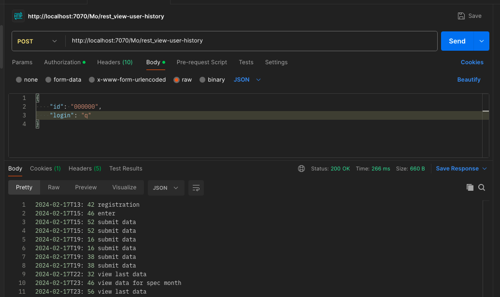

# Описание
Показания можно подавать один раз в месяц.
Ранее поданые показания редактировать запрещено.
Последние поданые показания считаются актуальными.
Пользователь может видеть только свои показания, администратор может видеть показания всех пользователей.
Реализация соответствует описанным ниже требованиям и ограничениям.

# Возможности
- предусмотрено расширение перечня подаваемых показаний
- данные хранятся в памяти приложения
- есть регистрация пользователя
- есть авторизация пользователя
- получение актуальных показаний счетчиков
-  подача показаний
- просмотр показаний за конкретный месяц
- просмотр истории подачи показаний
- контроль прав пользователя
- У админа - аудит действий пользователя (авторизация, завершение работы, подача показаний, получение истории подачи показаний и тд)

## Have a good job!