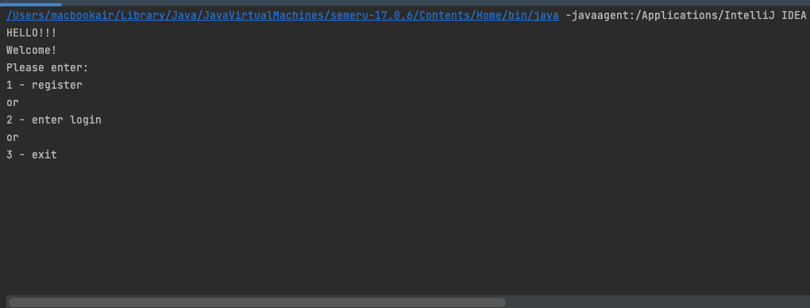

# Сервис для подачи показаний счетчиков отопления, горячей и холодной воды

## Welcome!

Работа в консоли

## Используемые технологии:

* Java 17

* Maven

### 1. Запуск приложения с maven.
Перейдите в корень проекта через командную строку и выполните команды:

```
mvn clean install
``` 



# Описание
Показания можно подавать один раз в месяц.
Ранее поданые показания редактировать запрещено.
Последние поданые показания считаются актуальными.
Пользователь может видеть только свои показания, администратор может видеть показания всех пользователей.
Реализация соответствует описанным ниже требованиям и ограничениям.

# Возможности
- предусмотрено расширение перечня подаваемых показаний
- данные хранятся в памяти приложения
- приложение консольное
- есть регистрация пользователя
- есть авторизация пользователя
- получение актуальных показаний счетчиков
-  подача показаний
- просмотр показаний за конкретный месяц
- просмотр истории подачи показаний
- контроль прав пользователя
- У админа - аудит действий пользователя (авторизация, завершение работы, подача показаний, получение истории подачи показаний и тд)

## Have a good job!
